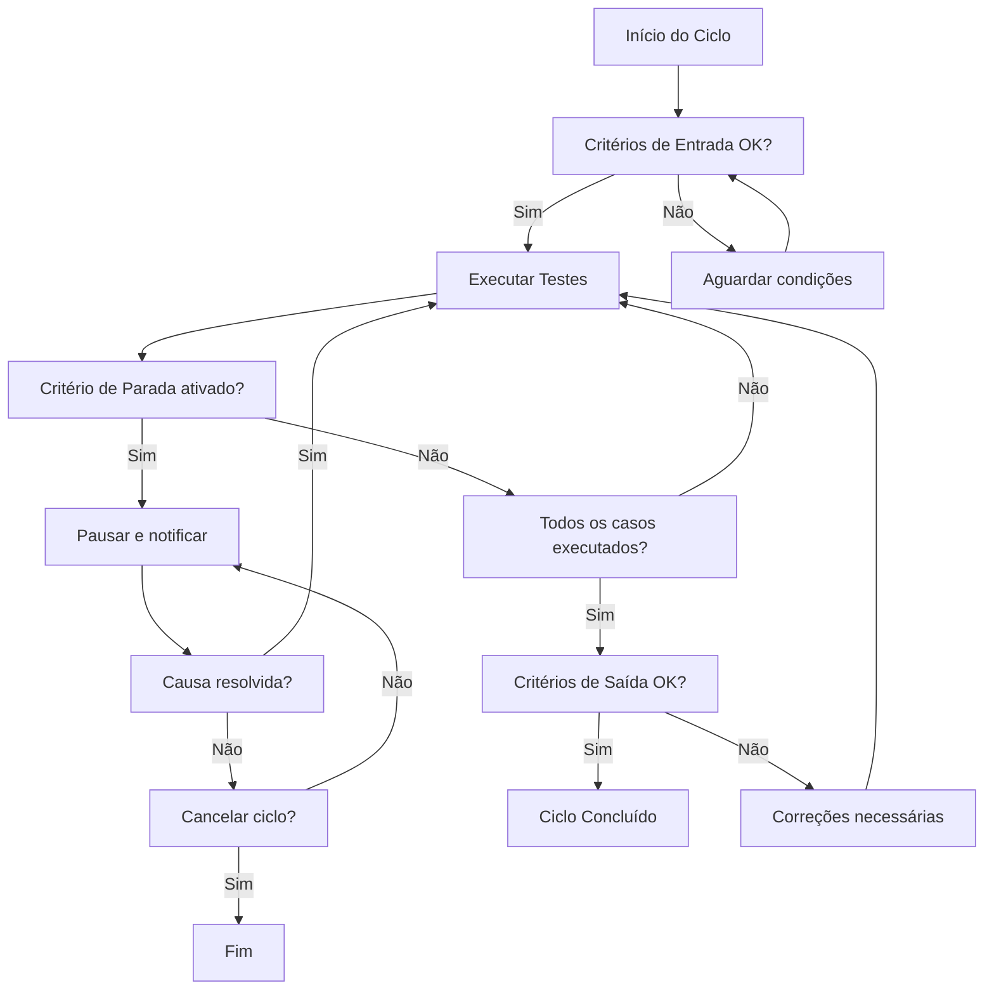

# Critérios de Entrada, Parada e Saída

## 1. Objetivo

Estabelecer as regras formais que determinam **quando iniciar**, **quando pausar** e **quando finalizar** cada ciclo de testes do sistema Pet Alliance.

---

## 2. Critérios de Entrada (Entry Criteria)

Condições que devem ser atendidas **antes** do início de cada ciclo de testes:

### 2.1. Gerais

| # | Critério | Responsável |
|---|---|---|
| E01 | O build/versão a ser testada está disponível no ambiente de desenvolvimento | Desenvolvedor |
| E02 | A conexão com o banco de dados está funcional | Desenvolvedor |
| E03 | As credenciais de acesso (usuários de teste) foram fornecidas | Desenvolvedor |
| E04 | O documento de requisitos (SRS) está aprovado e disponível | PO |
| E05 | As funcionalidades do ciclo foram finalizadas pelo time de desenvolvimento | Desenvolvedor |
| E06 | Ambiente de teste está acessível via navegador | Analista de Testes |
| E07 | Casos de teste do ciclo estão escritos e revisados | Analista de Testes |
| E08 | Nenhum defeito crítico ou blocker em aberto da iteração anterior | Analista de Testes |

### 2.2. Específicos por Funcionalidade

| Funcionalidade | Pré-condição |
|---|---|
| Cadastro de Usuário | Banco com tabela `tb_usuarios` vazia ou com dados controlados |
| Login | Usuário previamente cadastrado e email verificado |
| Match | Usuário logado com ao menos 1 pet cadastrado |
| Chat | Match já aceito entre dois usuários |
| Pagamento | Conta AbacatePay configurada no `.env` |
| Admin | Usuário com `tipo_usuario = 1` |

---

## 3. Critérios de Parada (Stop / Suspension Criteria)

Condições que, se ocorrerem, devem **pausar ou cancelar** o ciclo de testes até resolução:

### 3.1. Parada por Instabilidade Técnica

| # | Critério | Ação |
|---|---|---|
| S01 | Banco de dados offline ou corrompido | Pausar imediatamente; notificar dev |
| S02 | Servidor web (Apache) fora do ar | Pausar; aguardar restart |
| S03 | API externa (AbacatePay) retornando erros constantes | Pausar testes de pagamento |
| S04 | Erro 500 em mais de 30% das requisições | Pausar; escalar para dev |
| S05 | Perda de dados em ambiente compartilhado | Pausar; restaurar backup |

### 3.2. Parada por Qualidade

| # | Critério | Ação |
|---|---|---|
| S06 | Defeito **bloqueante** (impede progresso) encontrado | Pausar testes na funcionalidade afetada |
| S07 | Mais de 5 defeitos críticos abertos no ciclo atual | Pausar; priorizar correções |
| S08 | Mudança de requisito sem comunicação prévia | Pausar; realinhar escopo com PO |

### 3.3. Retomada

O ciclo pode ser retomado quando:

- A causa da parada for corrigida e validada pelo analista de testes
- O ambiente for restaurado e acessível
- O PO confirmar a estabilidade

---

## 4. Critérios de Saída (Exit Criteria)

Condições que devem ser atendidas para que o ciclo de testes seja considerado **concluído**:

### 4.1. Cobertura

| # | Critério | Meta |
|---|---|---|
| X01 | 100% dos requisitos funcionais do ciclo possuem ao menos 1 caso de teste associado (via RTM) | 100% |
| X02 | Todos os casos de teste foram executados | 100% |
| X03 | Casos de teste com falha têm defeito registrado | 100% |

### 4.2. Qualidade

| # | Critério | Meta |
|---|---|---|
| X04 | Nenhum defeito crítico ou blocker em aberto | 0 |
| X05 | Defeitos altos: no máximo 2 em aberto com plano de correção | ≤ 2 |
| X06 | Taxa de aprovação mínima nos casos executados | ≥ 90% |
| X07 | Defeitos rejeitados (não reproduzidos, duplicados) ≤ 10% do total | ≤ 10% |

### 4.3. Documentação

| # | Critério | Status |
|---|---|---|
| X08 | Relatório de execução gerado e revisado | Obrigatório |
| X09 | RTM atualizada com resultados | Obrigatório |
| X10 | Principais defeitos reportados aos desenvolvedores | Obrigatório |

### 4.4. Aprovação Final

| # | Critério | Responsável |
|---|---|---|
| X11 | PO / Cliente valida os resultados e assina a aceitação | PO |

---

## 5. Fluxo Decisório

---

## 6. Histórico de Revisões

| Versão | Data | Autor | Alteração |
|---|---|---|---|
| 1.0 | 08/07/2026 | Equipe de Qualidade | Criação inicial |
