# 🐾 Manual do Usuário — PetAlliance

**Guia bem simples, com figuras numeradas e explicações, para você usar o site sem medo de errar.**

> Este manual foi feito pensando em quem não tem experiência com computador.
> Siga os passos na ordem e veja as imagens: tudo que você precisa clicar está marcado com uma **bolinha numerada** na tela, e a explicação de cada número fica na **legenda** logo abaixo da imagem.
> As telas mostradas usam dados de exemplo (a "Maria" é uma conta de demonstração criada só para este manual).

---

## 📖 Sumário

1. [O que é o PetAlliance?](#1-o-que-é-o-petalliance)
2. [O que eu preciso para usar](#2-o-que-eu-preciso-para-usar)
3. [Primeira vez: criar minha conta](#3-primeira-vez-criar-minha-conta)
4. [Entrar no site (login)](#4-entrar-no-site-login)
5. [Esqueci minha senha](#5-esqueci-minha-senha)
6. [A página principal (Home)](#6-a-página-principal-home)
7. [Ver os detalhes de um animal](#7-ver-os-detalhes-de-um-animal)
8. [Cadastrar meu animal](#8-cadastrar-meu-animal)
9. [Meus animais (editar e excluir)](#9-meus-animais-editar-e-excluir)
10. [Favoritos (animais que eu gostei)](#10-favoritos-animais-que-eu-gostei)
11. [Pedidos de match (notificações)](#11-pedidos-de-match-notificações)
12. [Conversar com outros criadores (Chat)](#12-conversar-com-outros-criadores-chat)
13. [Meu perfil](#13-meu-perfil)
14. [Configurações](#14-configurações)
15. [Planos e pagamentos (virar membro)](#15-planos-e-pagamentos-virar-membro)
16. [Denúncias (reportar um problema)](#16-denúncias-reportar-um-problema)
17. [Tela do administrador (extra)](#17-tela-do-administrador-extra)
18. [Dicas de segurança](#18-dicas-de-segurança)
19. [Problemas comuns e como resolver](#19-problemas-comuns-e-como-resolver)
20. [Glossário simples](#20-glossário-simples)

---

## 1. O que é o PetAlliance?

O **PetAlliance** é um site que ajuda donos de animais de raça a encontrar **parceiros para cruzamento**.

- Você cadastra seu animal (com fotos e informações);
- O site mostra animais de outros criadores;
- Você **envia um pedido de match** para o dono do animal que você gostou;
- Se a pessoa **aceitar**, vocês podem **conversar pelo chat** para combinar o encontro;
- Quem quiser pode **virar membro** (paga um plano mensal) para ter destaque e vantagens.

Tudo é feito dentro do site, sem precisar ligar ou mandar carta. 😉

---

## 2. O que eu preciso para usar

| Item | Explicação |
|---|---|
| 💻 Computador ou tablet | Qualquer um serve (celular também funciona, mas o site foi feito para computador) |
| 🌐 Navegador | Chrome, Firefox ou Edge (aquele "E" azul do Windows) |
| 🔌 Internet | Para abrir o site |
| 📧 E-mail | Para criar a conta e receber avisos |
| 📄 CPF | Para criar a conta (é como uma "identidade" no site) |
| 📷 Fotos dos animais | De preferência no computador, para cadastrar seu pet |

---

## 3. Primeira vez: criar minha conta

**Passo 1 — Abra o site.** No navegador, digite o endereço do PetAlliance
(exemplo: `http://localhost:8080/` ou o endereço que a equipe te passar) e aperte **Enter**.

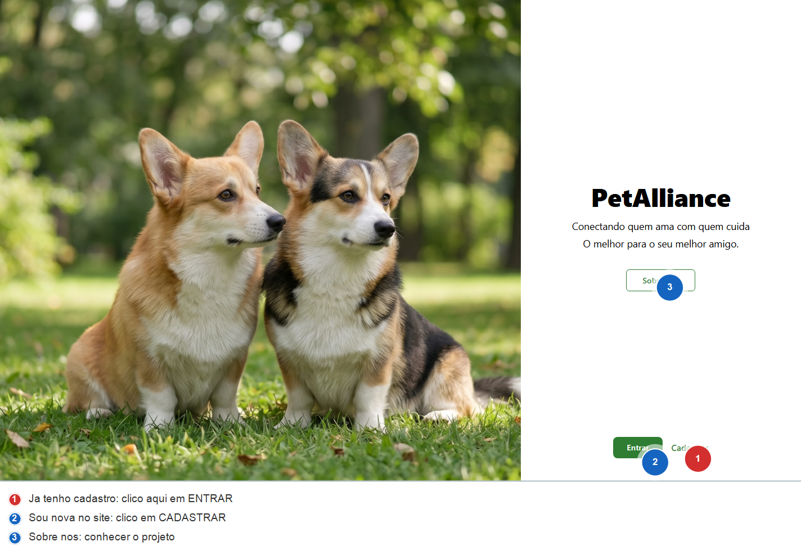

**Passo 2 — Clique no botão "CADASTRAR"** (bolinha azul **2** da imagem acima).

**Passo 3 — Preencha o formulário.** Veja a imagem abaixo e preencha cada campo na ordem:

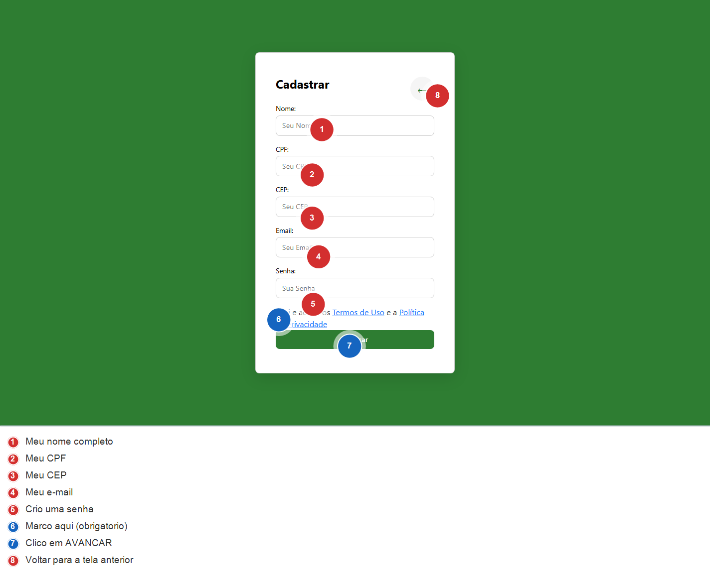

| Número | O que digitar |
|---|---|
| **1** | Seu **nome completo** |
| **2** | Seu **CPF** (só números, ou com pontos e traço — o site aceita dos dois jeitos) |
| **3** | Seu **CEP** (o número da sua rua, que fica no seu endereço) |
| **4** | Seu **e-mail** (aquele que você usa sempre) |
| **5** | Uma **senha** que só você vai saber (ex.: nome do seu pet + números) |
| **6** | **Marque o quadradinho** para aceitar os Termos e a Política de Privacidade (é obrigatório) |
| **7** | Clique em **AVANÇAR** |

**Passo 4 — Foto de perfil (opcional).** Na próxima tela, o site pergunta se você quer colocar uma foto sua. Você pode:
- Clicar em **"Escolher arquivo"** e selecionar uma foto do computador; ou
- Clicar em **"Pular"** para deixar para depois.

Depois clique em **CADASTRAR**.

**Passo 5 — Verifique seu e-mail.** O site vai enviar um **código** para o seu e-mail.
Abra o e-mail, copie o código e digite na tela do site. Pronto: sua conta está criada! ✅

---

## 4. Entrar no site (login)

**Passo 1 — Na tela inicial, clique em "ENTRAR"** (bolinha **1** da imagem da seção 3).

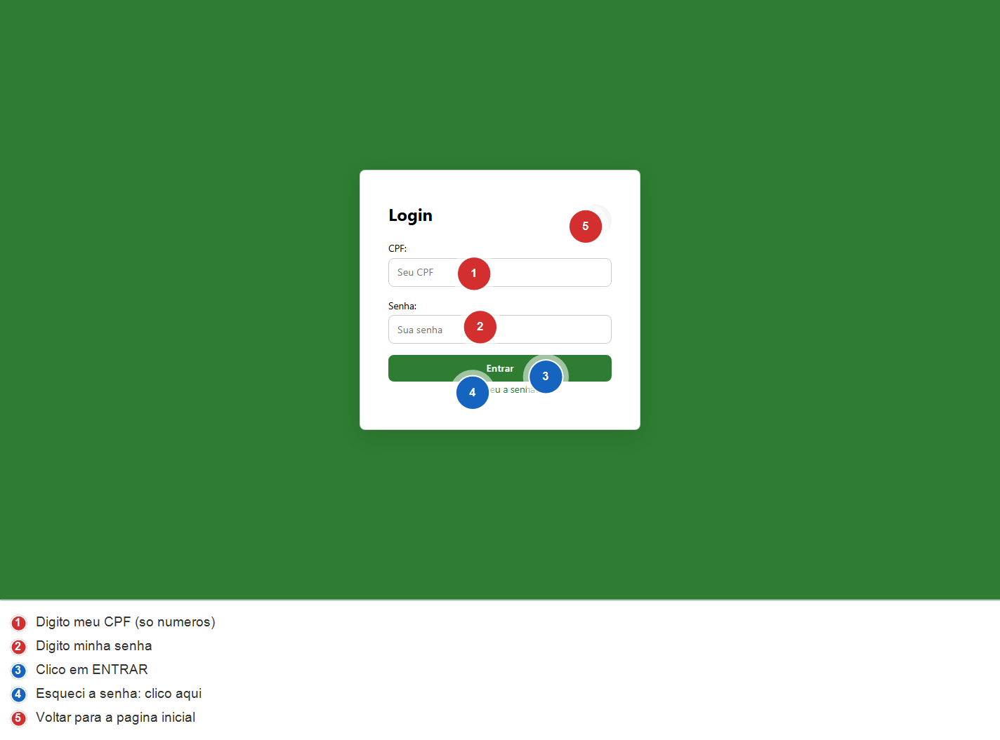

**Passo 2 — Digite seu CPF** (bolinha **1**) e sua **senha** (bolinha **2**).

**Passo 3 — Clique no botão ENTRAR** (bolinha **3**).

Pronto! Você vai cair na página principal do site. 🎉

> ⚠️ **Atenção:** se errar o CPF ou a senha, o site mostra uma mensagem vermelha. Confira se digitou tudo certinho e tente de novo.

---

## 5. Esqueci minha senha

Não se preocupe, todo mundo esquece! 😅

**Passo 1 — Na tela de login, clique em "Esqueceu a senha?"** (bolinha **4** da imagem da seção 4).

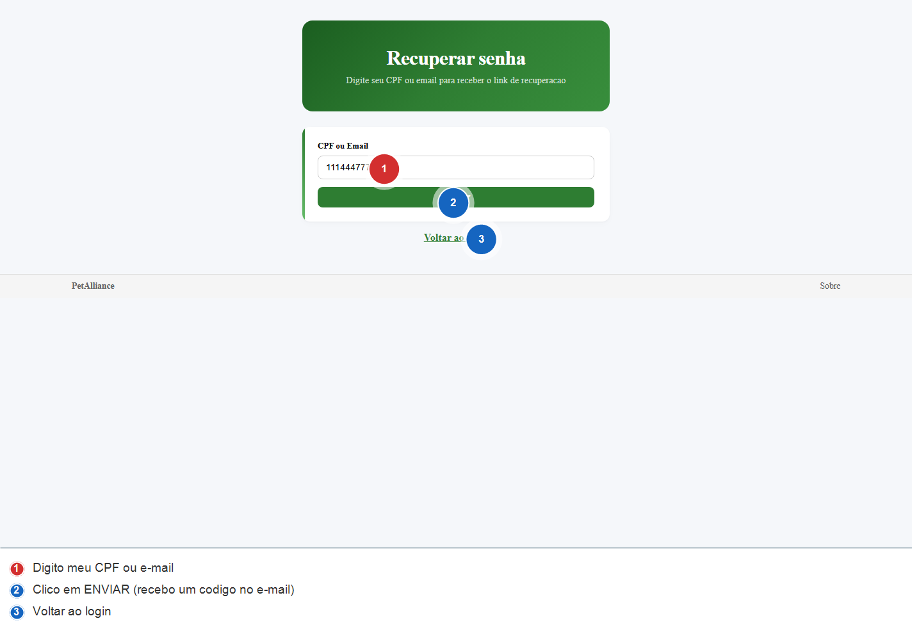

**Passo 2 — Digite seu CPF ou e-mail** (bolinha **1**) e clique em **ENVIAR** (bolinha **2**).

**Passo 3 — Abra seu e-mail.** Você vai receber um **código** do PetAlliance.

**Passo 4 — Digite o código no site** e crie uma **senha nova**. Anote a nova senha em um lugar seguro!

---

## 6. A página principal (Home)

Depois de entrar, você vê a página principal. É aqui que ficam todos os animais cadastrados.

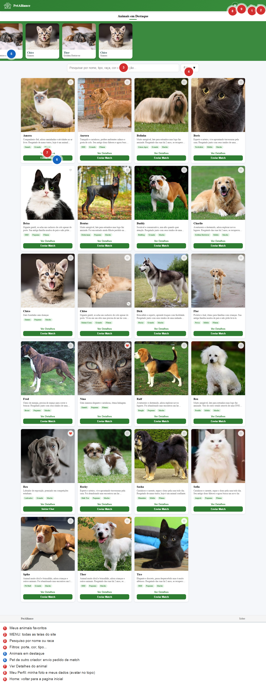

| Número | O que é | Para que serve |
|---|---|---|
| **1** | ♡ Coração (favoritos) | Ver os animais que você salvou |
| **2** | ☰ Menu | Abre a lista com todas as telas do site |
| **3** | Campo de pesquisa | Digite o nome ou a raça para achar um animal |
| **4** | Filtros | Escolher só cachorros, só gatos, porte pequeno, etc. |
| **5** | Animais em destaque | Animais de membros (aparecem no topo) |
| **6** | Enviar Match | Botão para pedir um "encontro" com o animal de outro criador |

**Como pesquisar:** clique no campo de pesquisa (bolinha **3**), digite a raça (ex.: `poodle`) e espere. A lista se ajusta sozinha.

**Como usar os filtros:** clique em **FILTROS** (bolinha **4**), marque as opções desejadas (ex.: Porte → Pequeno, Tipo → Cachorro) e clique em **Limpar Filtros** quando quiser voltar ao normal.

---

## 7. Ver os detalhes de um animal

**Passo 1 — Na página principal, clique no botão "Ver Detalhes"** do animal que você gostou.

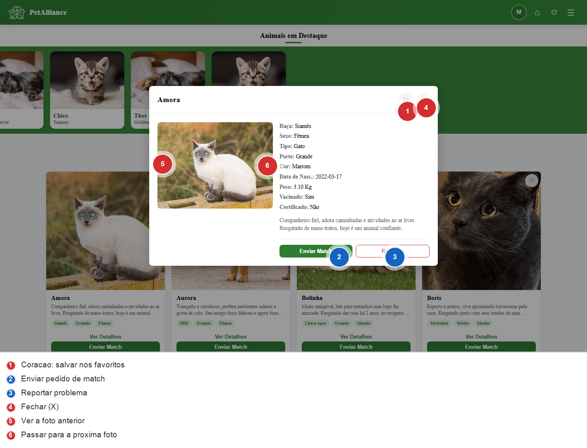

**Passo 2 — Na janela que abriu, você pode:**

| Número | O que faz |
|---|---|
| **1** | ♥ **Favoritar**: salva o animal na sua lista de favoritos |
| **2** | **Enviar Match**: manda um pedido para o dono do animal |
| **3** | **Reportar**: avisa a equipe se o anúncio tem algo errado (ver seção 16) |
| **4** | **✕ Fechar**: fecha a janela |

A janela mostra também as informações completas do animal: raça, sexo, porte, cor, data de nascimento, peso, se é vacinado e se tem certificado de raça.

> 💡 Se o animal tiver mais de uma foto, você pode **passar o mouse** sobre a foto para vê-las passando, ou usar as setinhas **‹** e **›** da janela.

---

## 8. Cadastrar meu animal

**Passo 1 — Abra o menu** (botão ☰ no topo, bolinha **2** da seção 6) e clique em **"Cadastrar Animal"**.

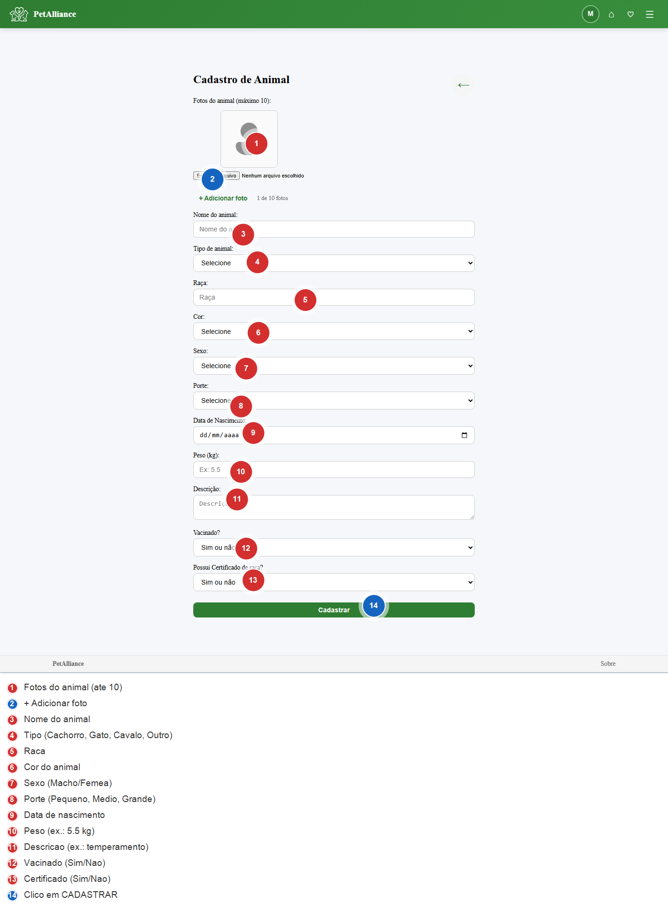

**Passo 2 — Preencha o formulário (na ordem dos números):**

| Número | O que fazer |
|---|---|
| **1** | **Fotos**: clique em "Escolher arquivo" e selecione até 10 fotos do seu animal (a primeira foto é a principal) |
| **2** | **+ Adicionar foto**: para incluir mais fotos depois |
| **3** | **Nome do animal** (ex.: Thor) |
| **4** | **Tipo**: Cachorro, Gato, Cavalo ou Outro |
| **5** | **Raça** (ex.: Golden Retriever) — se não souber, escreva "SRD" |
| **6** | **Cor** do animal |
| **7** | **Sexo**: Macho ou Fêmea |
| **8** | **Porte**: Pequeno, Médio ou Grande |
| **9** | **Data de nascimento** |
| **10** | **Peso** (ex.: 5.5) |
| **11** | **Descrição**: conte como ele é (ex.: "dócil, brincalhão, ótimo para cruzamento") |
| **12** | **Vacinado**: Sim ou Não |
| **13** | **Certificado de raça**: Sim ou Não |
| **14** | Clique em **CADASTRAR** |

> ✅ Quando terminar, o site mostra a mensagem "Animal cadastrado com sucesso".

---

## 9. Meus animais (editar e excluir)

**Passo 1 — Abra o menu** (☰) e clique em **"Meus Animais"**. Você vê todos os seus pets:

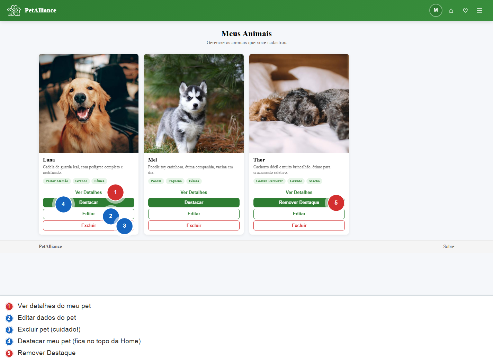

| Número | O que faz |
|---|---|
| **1** | **Ver Detalhes**: abre as informações do animal |
| **2** | **Editar**: muda as informações (nome, raça, fotos etc.) |
| **3** | **Excluir**: remove o animal do site *(cuidado: não tem como desfazer!)* |
| **4** | **Destacar**: faz seu pet aparecer no topo da Home para todo mundo ver |
| **5** | **Remover Destaque**: tira o pet do destaque |

---

## 10. Favoritos (animais que eu gostei)

**Passo 1 — Clique no coração ♡** no topo da página (bolinha **1** da seção 6).

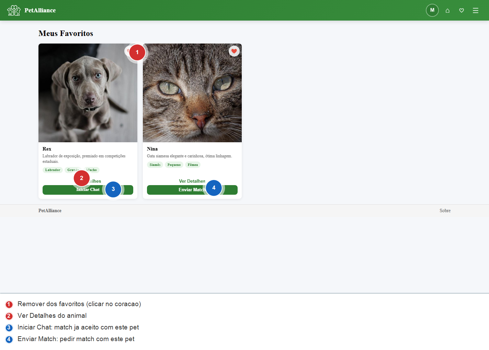

| Número | O que faz |
|---|---|
| **1** | **Remover favorito**: clique no coração ♥ em cima da foto para tirar da lista |
| **2** | **Ver Detalhes**: abre as informações do animal |
| **3** | **Iniciar Chat**: conversar com o criador (quando o match já foi aceito) |
| **4** | **Enviar Match**: pedir um match com este animal |

---

## 11. Pedidos de match (notificações)

Quando alguém pede um "match" com seu animal, você recebe um aviso. Para ver:

**Passo 1 — Abra o menu** (☰) e clique em **"Notificações"**.

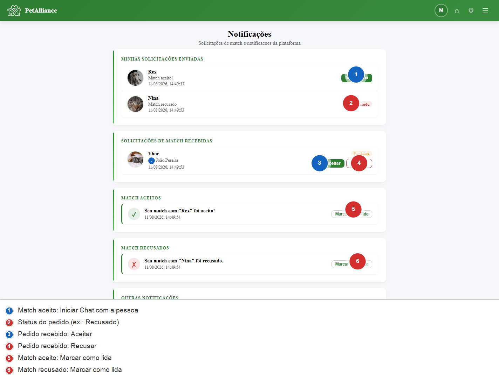

**Passo 2 — Veja seus pedidos** (cada cartão mostra o pet, a pessoa e a data):

| Número | O que fazer |
|---|---|
| **1** | **Iniciar Chat**: quando o match foi aceito, o botão vira "Iniciar Chat" |
| **2** | **Status do pedido**: Pendente, Aceito ou Recusado |
| **3** | **Aceitar**: você aceita o encontro. O chat com a pessoa é liberado! |
| **4** | **Recusar**: você não quer. O pedido é arquivado como recusado |
| **5** | **Marcar como lida** (Match aceito): limpa o aviso |
| **6** | **Marcar como lida** (Match recusado): limpa o aviso |

---

## 12. Conversar com outros criadores (Chat)

Depois que um match é **aceito**, vocês podem conversar pelo chat do site.

**Passo 1 — Abra o menu** (☰) e clique em **"Chat"**. Ou, na home, clique em **"Iniciar Chat"** no card do animal com match aceito.

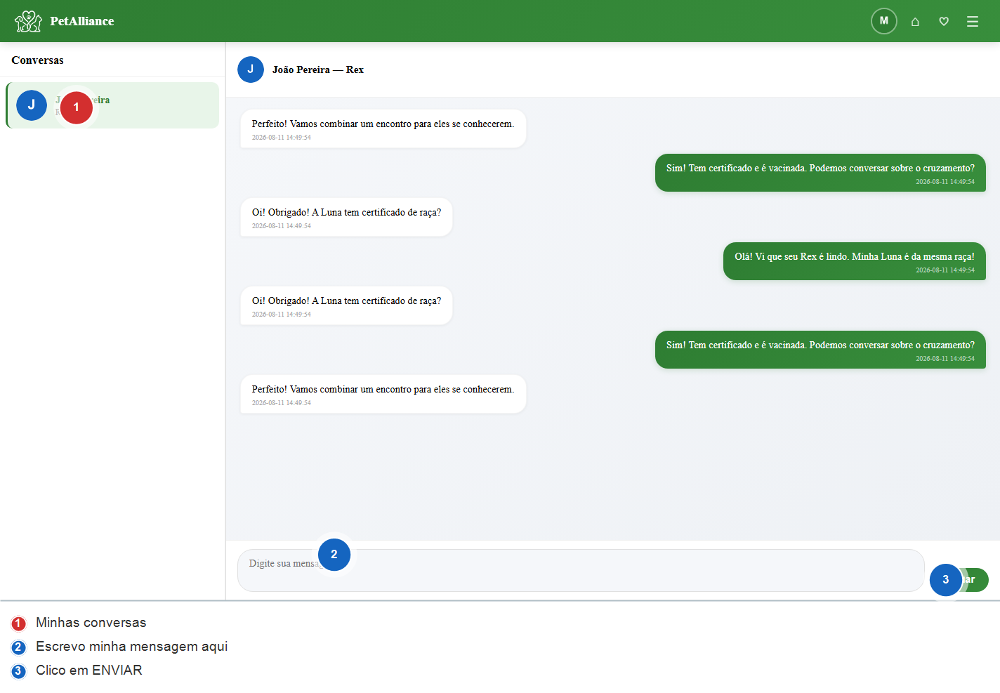

| Número | O que fazer |
|---|---|
| **1** | Suas conversas ficam aqui. Clique em uma conversa para abrir |
| **2** | Escreva sua mensagem neste campo |
| **3** | Clique em **ENVIAR** para mandar a mensagem |

> 💡 As mensagens que **você** enviou aparecem de um lado (verde) e as da outra pessoa do outro lado. É igual WhatsApp!

---

## 13. Meu perfil

**Passo 1 — Clique na sua foto** (ou na letra do seu nome) no topo da página, ou abra o menu (☰) e clique em **"Perfil"**.

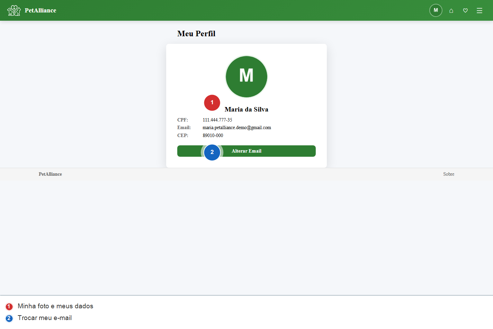

Aqui aparecem sua **foto, nome, CPF, e-mail e CEP**. Para trocar o e-mail, clique no botão **Alterar Email** (bolinha da imagem) e siga as instruções (o site envia um código para o e-mail novo).

---

## 14. Configurações

**Passo 1 — Abra o menu** (☰) e clique em **"Configurações"**.

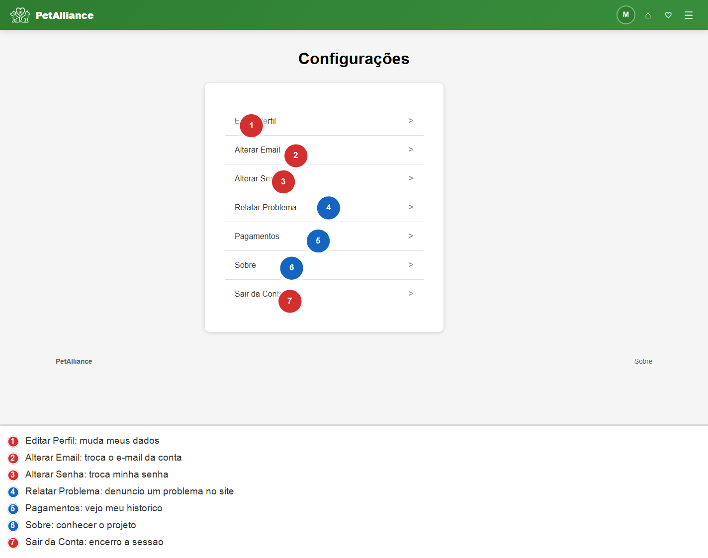

| Número | O que faz |
|---|---|
| **1** | **Editar Perfil**: muda nome, foto e outros dados |
| **2** | **Alterar Email**: troca o e-mail da conta |
| **3** | **Alterar Senha**: troca sua senha (pede a senha atual) |
| **4** | **Relatar Problema**: denuncia um problema no site (seção 16) |
| **5** | **Pagamentos**: vê seu histórico de pagamentos (seção 15) |
| **6** | **Sobre**: conhecer o projeto |
| **7** | **Sair da Conta**: termina a sessão com segurança (faça isso em computadores de outras pessoas!) |

---

## 15. Planos e pagamentos (virar membro)

Ser membro dá vantagens: **badge de membro** (selo de verificado), **destaque para seus animais** (eles aparecem no topo da home) e mais.

**Passo 1 — Abra o menu** (☰) e clique em **"Membros"**.

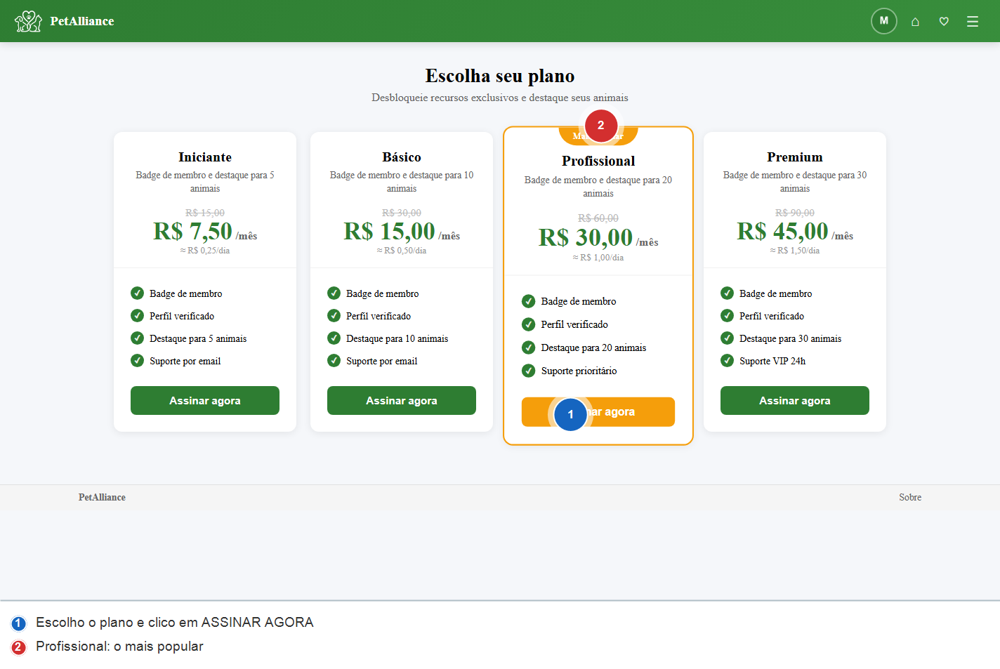

**Passo 2 — Escolha um plano.** Existem 4:

| Plano | Preço/mês | Destaques |
|---|---|---|
| Iniciante | R$ 7,50 | 5 animais |
| Básico | R$ 15,00 | 10 animais |
| Profissional (⭐ mais popular) | R$ 30,00 | 20 animais |
| Premium | R$ 45,00 | 30 animais |

**Passo 3 — Clique em "ASSINAR AGORA"** no plano escolhido (bolinha **1**).

**Passo 4 — Confirme o pagamento:**

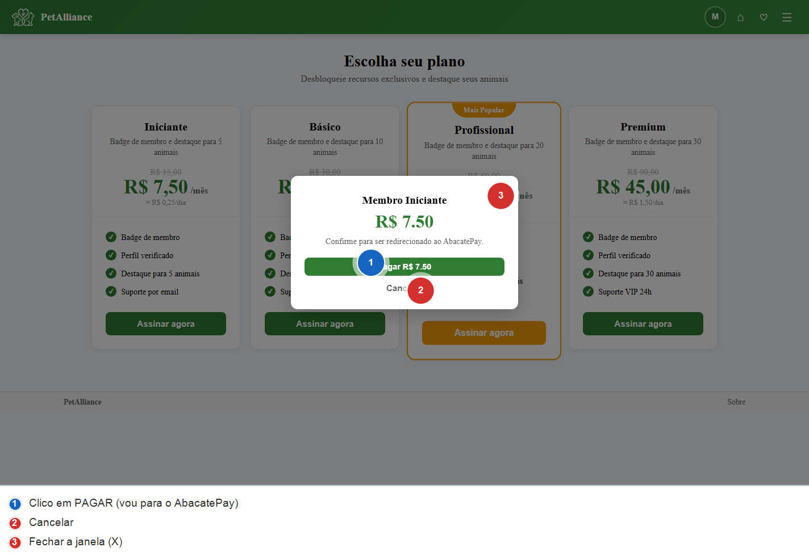

Clique em **PAGAR** (numero na imagem). Você será levado para o **AbacatePay** (a empresa que cuida do pagamento) — lá você paga com Pix ou cartão. Depois de pagar, volte ao site: seu plano já fica ativo!

**Onde vejo meus pagamentos?** Abra o menu (☰) → **Configurações** → **Pagamentos**:

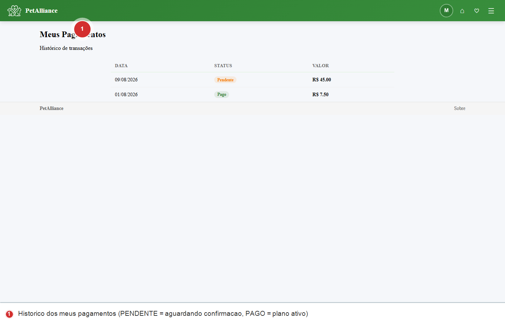

| Número | Significado |
|---|---|
| **1** | **Pendente**: o pagamento ainda não foi confirmado |
| **2** | **Pago**: pagamento confirmado — seu plano está ativo! ✅ |

> 💡 **Dica:** com o plano ativo, vá em "Meus Animais" e use o botão de **destacar** para seus pets aparecerem no topo da página principal.

---

## 16. Denúncias (reportar um problema)

Viu um anúncio estranho, um preço absurdo ou alguém pedindo pagamento fora do site? **Denuncie!**

**Passo 1 — No card ou na janela do animal, clique em "Reportar"** (bolinha **3** da seção 7).
Também dá para denunciar problemas do site: **Menu** (☰) → **Configurações** → **Relatar Problema**.

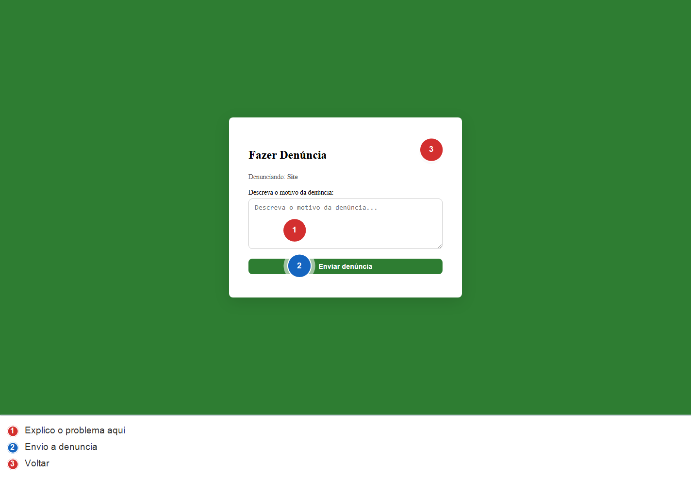

**Passo 2 — Escreva o motivo** (bolinha **1**) com calma e detalhes (ex.: "o anúncio pede pagamento fora do site").

**Passo 3 — Clique em "Enviar Denúncia"** (bolinha **2**). A equipe vai analisar. Ninguém fica sabendo que foi você!

---

## 17. Tela do administrador (extra)

> Esta parte é **só para administradores** (a equipe do site). Se a sua conta for de usuário comum, você não verá essas opções no menu.

**Denúncias:** no menu, aparece "Ver Denúncias" — a lista de denúncias enviadas pelos usuários:

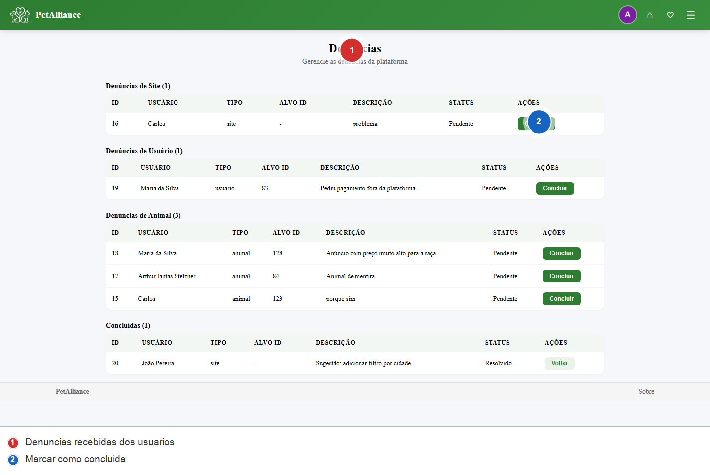

- A tabela mostra o tipo (animal, usuário ou site), quem denunciou e a descrição;
- Clique em **Concluir** quando a denúncia for resolvida (ela vai para a seção "Concluídas" no final da página).

**Estatísticas:** no menu, aparece "Estatísticas" — os números do site:

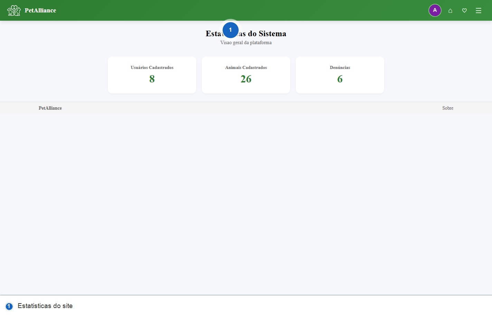

Mostra quantos **usuários**, **animais** e **denúncias** existem. Também pode mostrar gráficos de atividade.

---

## 18. Dicas de segurança

🛡️ **Regras de ouro para usar o site com tranquilidade:**

1. **Nunca conte sua senha para ninguém** — nem para filhos, nem para netos! A equipe do site nunca pede sua senha.
2. **Nunca pague nada fora do site.** O pagamento é só pelo AbacatePay, dentro do site. Se alguém pedir Pix "por fora", **denuncie** (seção 16).
3. **Desconfie de ofertas boas demais.** Antes de fechar um cruzamento ou compra, converse bastante pelo chat e peça fotos/vídeos.
4. **Sempre clique em "Sair da Conta"** quando terminar de usar (principalmente em computador compartilhado).
5. **Não clique em links estranhos** recebidos por e-mail ou mensagem pedindo sua senha.
6. **Mantenha seu e-mail verificado** e seu número de telefone atualizado, para receber avisos importantes.

---

## 19. Problemas comuns e como resolver

| Problema | O que fazer |
|---|---|
| **"Não consigo entrar"** | Confira se o CPF e a senha estão certos (sem espaços). Se ainda assim não entrar, use "Esqueceu a senha?" (seção 5) |
| **"Minha página não carrega"** | Verifique se a internet está funcionando. Espere 1 minuto e aperte **F5** (ou o botão de recarregar do navegador) |
| **"Esqueci meu e-mail"** | O site usa seu CPF para entrar — a senha você pode recuperar pelo CPF (seção 5) |
| **"Não consigo enviar fotos"** | As fotos devem ser JPG, PNG ou WEBP. Tire fotos menores com o celular e envie para o computador |
| **"Meu pagamento não confirmou"** | O Pix pode demorar alguns minutos. Confira em Configurações → Pagamentos (seção 15). Se continuar "Pendente" por mais de 1 dia, fale com a equipe |
| **"Alguém está me incomodando no chat"** | Denuncie a pessoa (seção 16) e recuse o match |

---

## 20. Glossário simples

| Palavra | Significado |
|---|---|
| **Login** | Entrar no site com CPF e senha |
| **Cadastro** | Criar sua conta (nome, CPF, e-mail, senha) |
| **Match** | O "combinado" entre dois animais para cruzamento |
| **Enviar match** | Pedir ao dono de um animal para fazer um cruzamento com o seu |
| **Favoritar** | Salvar um animal na sua lista para achar fácil depois |
| **Destaque** | Posição especial no topo da página para um animal aparecer mais |
| **Badge de membro** | Selo que aparece no perfil de quem paga um plano |
| **Plano / Assinatura** | Pagamento mensal para ter vantagens no site |
| **Chat** | Conversa escrita entre duas pessoas, dentro do site |
| **Denúncia** | Aviso à equipe sobre um problema (anúncio, pessoa ou site) |
| **Verificar e-mail** | Confirmar que o e-mail é seu (usando o código recebido) |
| **Sessão** | O tempo em que você fica "logado" no site até sair |

---

## 🎉 Parabéns!

Você já sabe o essencial para usar o PetAlliance. Comece criando sua conta, cadastre seu animal e envie seu primeiro match. Se tiver dúvidas, a equipe do site está sempre disponível!

**Bom cruzamento! 🐶🐱**
